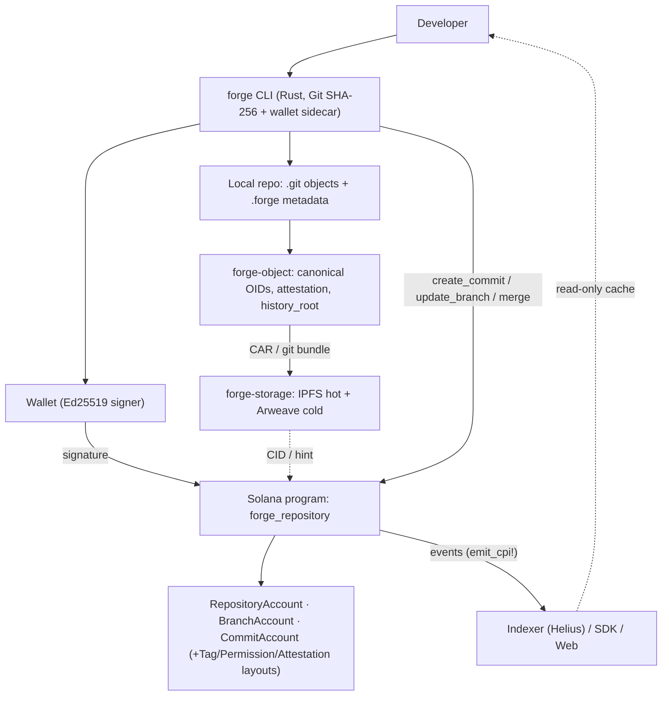
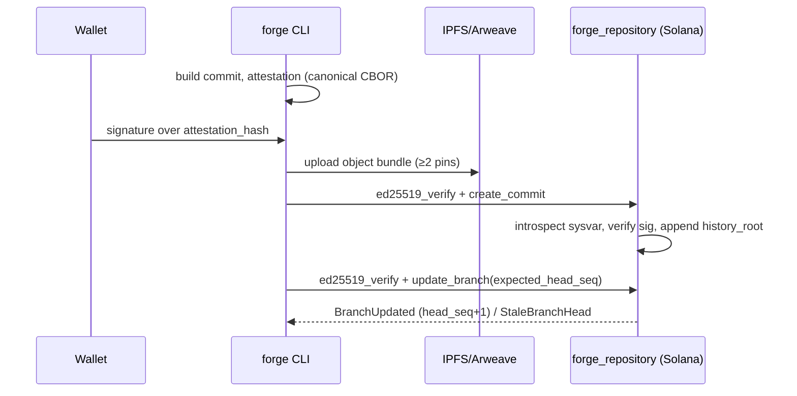

# Forge — Architecture

> Status: **Phases 1–9 implemented; Phase 10 partial** (TypeScript SDK core,
> benchmark, and demo docs done; explorer UI and indexer pending). This document
> reflects the code as built; items marked `[ ]` are scheduled in Phase 10b (see
> `../phase_implementation.md`). Canonical byte formats are in
> [`protocol.md`](protocol.md); frozen design decisions are in [`adr/`](adr/).

Legend: `[✓]` implemented (Phases 1–9 + SDK) · `[ ]` planned (Phase 10b) · `*` layout only.

---

## 1. System architecture

```text
┌────────────────────────────────────────────────────────────────────────────────────┐
│                                      DEVELOPER                                       │
│   forge CLI (Rust; Git CLI + gix SHA-256 open; ADR 0007)              [✓]            │
│   [✓] Phase 7 local: init/add/commit/status/log/branch/checkout/remote/verify        │
│   [✓] Phase 8 chain: push/pull/clone/verify (ADR 0008)                               │
└───────────────┬─────────────────────────────────────────────────┬──────────────────┘
                │                                                 │
                ▼                                                 ▼
┌───────────────────────────────────┐             ┌───────────────────────────────────┐
│        LOCAL REPOSITORY           │             │        WALLET (Ed25519)           │
│  .git/  blobs · trees · commits   │             │  signs attestation_hash +         │
│  .forge/                          │             │  branch-update/reset messages     │
│    config                         │             └───────────────┬───────────────────┘
│    attestations/<oid>.cbor+.sig   │                             │ signature
│    storage-index                  │                             │
│    onchain-refs (heads + seq)     │                             │
└───────────┬───────────────────────┘                             │
            │ object bytes                                        │
            ▼                                                     │
┌───────────────────────────────────┐                             │
│   forge-object  (canonical engine)│   OIDs · attestation_hash   │
│   object  blob  tree  commit      │   history_root · branch msg │
│   attestation (canonical CBOR)    │                             │
│   history  branch  path  hash     │                             │
└───────────┬───────────────────────┘                             │
            │ CAR / git bundle (hash-addressed)                   │
            ▼                                                     │
┌───────────────────────────────────┐                             │
│   CONTENT-ADDRESSED STORAGE       │   CID / storage hint        │
│   IPFS  (hot, ≥2 pins)            │──────────────┐              │
│   Arweave (tags / checkpoints)    │              │              │
│   [✓] Phase 6  forge-storage      │              │              │
└───────────────────────────────────┘              │              │
                                                   ▼              ▼
                                     ┌──────────────────────────────────────────────┐
                                     │              SOLANA (devnet)                  │
                                     │   Anchor program: forge_repository            │
                                     │                                               │
│   Accounts            Instructions            │
│   ─────────           ────────────            │
│   RepositoryAccount   initialize_repository   │
│   BranchAccount       create_branch           │
│   CommitAccount       create_commit           │
│   TagAccount          update_branch           │
│   PermissionAccount   reset_branch            │
│   ProgramSourceAtt.   delete_branch           │
│                       merge                   │
│                       create_tag              │
│                       update_permissions      │
│                       transfer_repository     │
│                       anchor_program_source   │
                                     └───────────────┬──────────────────────────────┘
                                                     │ events (emit_cpi!, not logs)
                                                     ▼
                                     ┌──────────────────────────────────────────────┐
                                     │   INDEXER (Helius) · SDK (@solana/kit) · WEB  │
                                     │   non-authoritative cache / human interface   │
                                     │   [~] Phase 10: SDK core ✓ · web/indexer [ ]  │
                                     └──────────────────────────────────────────────┘
```

---

## 2. Onchain program map

```text
PDA seeds
  repo   ["repo",   owner,     name]        branch ["branch", repo, name]
  commit ["commit", repo, commit_oid]       tag    ["tag", repo, name]
  perm   ["perm",   repo, contributor]      prog   ["prog", program_id]

initialize_repository(name, default_branch, storage_backend, flags)
   ├─ init RepositoryAccount   (genesis history_root, commit_count=0)
   ├─ init BranchAccount       (head=0, head_seq=0, authority=owner)
   └─ event RepositoryInitialized

create_branch(name, from_commit)
   ├─ require owner; optional existing commit (PDA check)
   ├─ init BranchAccount       (head_seq=0)
   └─ event BranchCreated

create_commit(commit_oid, parent_count, parent_a, parent_b, tree_oid,
              authored_at, message_hash, attestation_hash)
   ├─ prepended Ed25519 native ix  +  Instructions sysvar introspection
   ├─ require owner; parent rules (0/1/2, zero-oid, self-parent, root-only-first)
   ├─ init CommitAccount       (PDA = ["commit", repo, commit_oid])
   ├─ history_root = append(prev, commit_oid, seq);  commit_count += 1
   └─ event CommitCreated

update_branch(new_head, expected_head_seq)          ── CAS on head_seq
   ├─ require owner; require branch.head_seq == expected_head_seq (else StaleBranchHead)
   ├─ fast-forward (parent_a == head) OR merge (one of two parents == head)
   ├─ Ed25519 over "forge-branch-update\0"||repo||name||new_head||seq
   ├─ branch.head = new_head; head_seq += 1
   └─ event BranchUpdated

merge(merge_commit_oid, expected_target_seq)
   ├─ target/source branches; merge_commit.parents == {target.head, source.head}
   ├─ CAS on target.head_seq; Ed25519 over target update message
   └─ event BranchUpdated

reset_branch(new_head, expected_head_seq)           ── explicit rewrite
   ├─ CAS; commit must exist; NO fast-forward requirement
   ├─ Ed25519 over "forge-branch-reset\0"||repo||name||new_head||seq
   ├─ branch.head = new_head; head_seq += 1     (history_root UNCHANGED)
   └─ event BranchReset

delete_branch()
   ├─ require owner; forbid default branch (else CannotDeleteDefaultBranch)
   ├─ close BranchAccount (rent refund)
   └─ event BranchDeleted

create_tag(name, target_commit, message_hash)        ── Phase 9
   ├─ writer role; target commit exists; Ed25519 over "forge-tag\0"||repo||name||commit||msg
   ├─ init TagAccount (immutable); signed = 1
   └─ event TagCreated

update_permissions(contributor, role, expires_slot)  ── Phase 9
   ├─ owner-only admin; role <= admin (else InvalidRole)
   ├─ create or update PermissionAccount (no init_if_needed)
   └─ event PermissionChanged

transfer_repository(new_owner)                       ── Phase 9
   ├─ require owner; update RepositoryAccount.owner
   └─ event RepositoryTransferred

anchor_program_source(program_id, commit_oid, artifact_hash, build_metadata_hash) ── Phase 9
   ├─ writer role; commit in history; program loader-owned + executable; hash non-zero
   ├─ init ProgramSourceAttestation ["prog", program_id] (verified = 0, a claim)
   └─ event ProgramSourceAnchored
```

---

## 3. Data flow — `forge push` (Phase 8)

```text
 forge commit (local)                         forge push
 ────────────────────                         ──────────
 build blobs/trees/commit ──► commit_oid
 build attestation (canonical CBOR)
 wallet signs attestation_hash ──► signature
                          │
                          ▼
        ┌─────────────────────────────────────────────────────────────┐
        │ 1. upload missing objects to IPFS (≥2 pins)  [✓ Phase 6/8]    │
        │    build CAR/git-bundle; record CIDs in .forge/storage-index│
        └───────────────────────────────┬─────────────────────────────┘
                                        ▼
        ┌─────────────────────────────────────────────────────────────┐
        │ 2. tx1: [ ed25519_verify(author, sig, attestation_hash),    │
        │           create_commit(...) ]                              │
        │    program introspects prev ix, verifies, appends history   │
        └───────────────────────────────┬─────────────────────────────┘
                                        ▼
        ┌─────────────────────────────────────────────────────────────┐
        │ 3. tx2: [ ed25519_verify(author, sig2, update_msg),         │
        │           update_branch(new_head, expected_head_seq) ]      │
        │    CAS: success → head_seq+1; stale → refetch, rebase, retry│
        └───────────────────────────────┬─────────────────────────────┘
                                        ▼
        forge clone / pull / verify  ◄── read anchored refs + fetch by OID,
                                         re-hash every object, check signature
                                         and history_root inclusion
```

---

## 4. Commit & branch lifecycle

```text
 first commit              normal commit            merge commit
 ───────────               ─────────────            ────────────
 parent_count = 0          parent_count = 1         parent_count = 2
 only on empty repo        parent_a = branch.head   {parent_a,parent_b} =
                                                    {target.head, source.head}

 branch head movement:
   head=0 ──update(any existing commit)──► C1 ──update(FF)──► C2
                                              │
                                              ├──merge(C2, Cb)──► M
                                              └──reset(X, non-FF)──► X   (logged, history kept)

 history_root  (append-only, never rolls back):
   genesis ──► +C1/seq0 ──► +C2/seq1 ──► +M/seq2 ──► ...
        reset_branch does NOT append or erase here
```

---

## 5. Diagrams as code (Mermaid)




